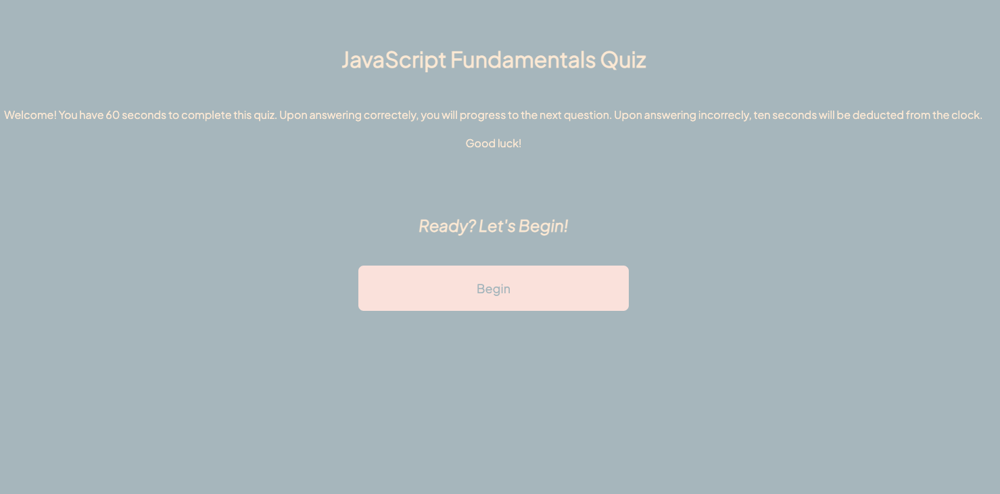

# Code-Quiz
### Description
For this challenge, my goal was to create a quiz on JavaScript fundamentals. Upon launching, the user is greeted with a welcome message that describes the quiz as well as a begin button that will start the timer and display the quiz questions. After they answer one questions, the next will appear. When a question is answered incorrectly, ten seconds are deducted from their time. At the end, they are able to save their score and initals, which  will still appear after page reload.
## Visuals 
 
  ## Resources 
 * Live Site (https://untjala.github.io/code-quiz/)
 * Repository (https://github.com/untjala/code-quiz)